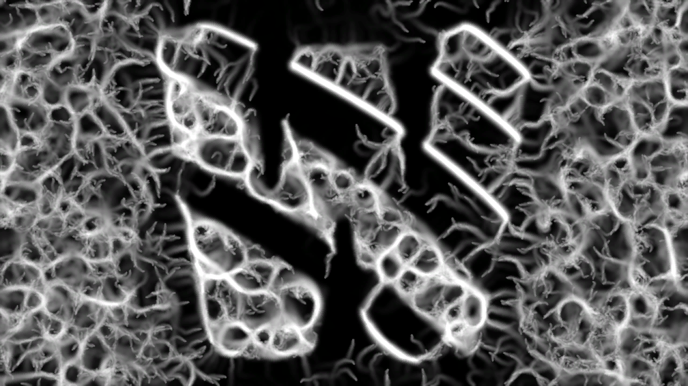
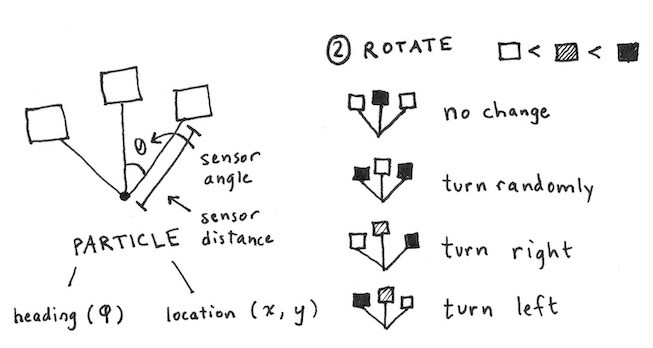

# Physarum

## General Idea
Every agent has 3 sensors. One in front and two to the side. The agent will decide if it turns left, right, or stays on it's path, depending on what it sees with it's sensor. If it turns left/right, it will do so randomly within a given movement angle. 

Sage Johnson has a [great article](https://cargocollective.com/sagejenson/physarum) about his Physarum / slime mold implementation. Sebastian Lague has a [great video](https://www.youtube.com/watch?v=X-iSQQgOd1A) about this topic, too.

## Options

| Group   | Name             | Type | Description                                                                                         |
|---------|------------------|------|-----------------------------------------------------------------------------------------------------|
|         | Agents       |   Int   | Number of agents simulated. This should be a square number to avoid glitching agents, e.g. 3*3 or 15*15 or 50*50 or ... |
|         | Speed        |   Float   | How far an agent walks per frame in (fractional) pixels. Should be lower than the Sensor Distance.  |
|         | Agent Visibility |   Float   | Visibility of the agents itself.                                                                    |
|         | Trail Visibility |   Float   | Visibility of the trail the agents leave behind them.                                               |
|         | Reset Agents     |   Trigger   | Reset the position of all agents but keep their trail.                                              |
|         | Reset Trails     |  Trigger    | Reset the agents trails but keep the agents where they are.                                         |
| **Affinity**|         |      | If agents "see" one of these with their sensors, do they try to move towards it or away from it?    |
|         | Image            |  Float    | 1 means the agent moves towards bright image areas, -1 means it moves away (towards dark areas).    |
|         | Trail            |  Float    | 1 means the agent moves along other agents paths, -1 avoids them.                                   |
|         | Agent            |  Float    | 1 means the agent moves towards other agents, -1 avoids them.                                       |
| **Border**  |            |      |                                                                                                     |
|         | Size             |  Float    | Size of the (rectangular) border. Contains the agents.                                              |
|         | Overstep         |   Option  | Agent behavior when encountering a border.                                                          |
| **Agents**  |            |      |                                                                                                     |
|         | Size             |   Float   | Size of every agent.                                                                                |
|         | Motion Angle     |   Float   | The possible angle of movement of an agent. 360 means the agent may move in any direction.          |
|         | Show Debug       |    Bool  | Show a debug overlay of the agent and its sensor.                                                   |
| **Sensor**  |           |      | An agent has 3 sensors. To the left, right and middle.                                              |
|         | Angle            |   Float   | The angle of the sensors to the left and right of the agent.                                        |
|         | Distance         |    Float  | How far away the sensor is from the agent.                                                          |
|         | Size             |   Float   | The size of the sensor.                                                                             |
| **Trail**   |            |      |                                                                                                     |
|         | Strength         |  Float    | How long the trail behind agents stays.                                                             |
|         | Diffusion        |   Float   | How the trail spreads out over time.                                                                |