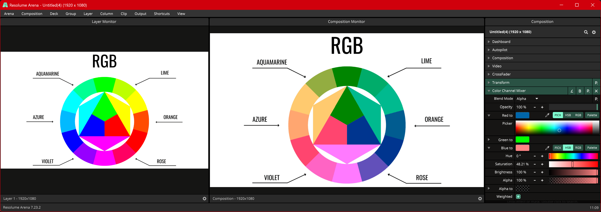
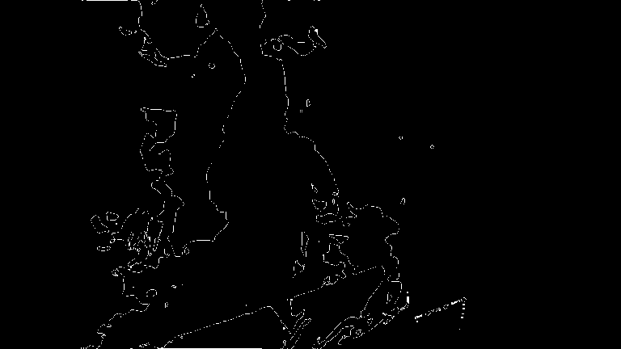
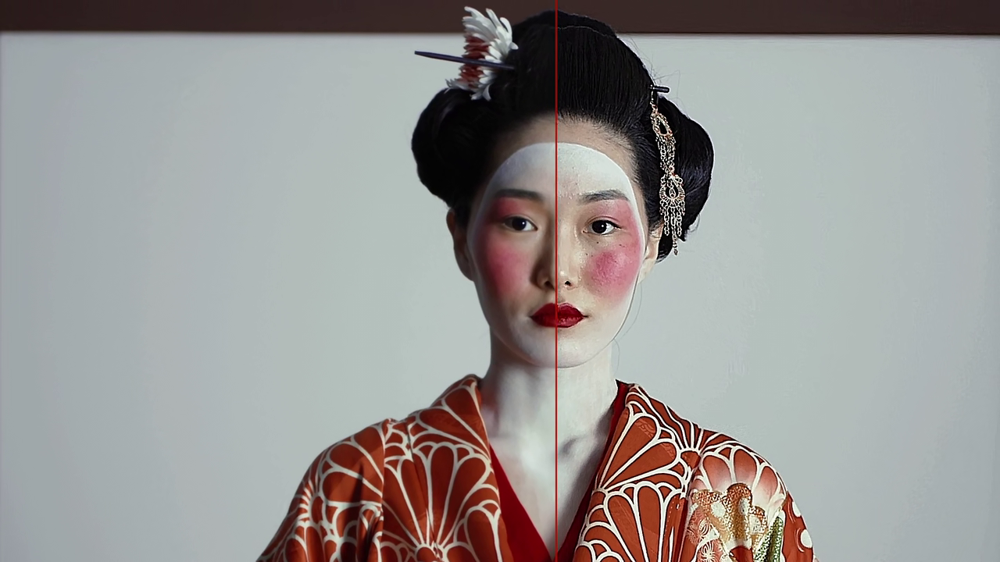

# Wire Patches

This is a private collection of [Resolume](https://resolume.com/) Wire patches. Something between case studies and actually useful stuff. 

## Legal Disclaimer

Everything is under **GPL-3** license which means you may use it commercially. However, if you use this as a base for another patch, it has to fall under GPL-3, too. You are **not allowed to sell** derivative work based on these patches but open source it and give back to the community.

For more info see https://www.tldrlegal.com/license/gnu-general-public-license-v3-gpl-3

## Patches

### Color Channel Mixer (Effect)

Turns R, G, B channels into any other color while it's possible to preserving overall luminance. Basically a base vector rotation in color space.

### Conway's Game of Life (Effect)

Cellular automaton simulating Conway's Game of Life. Input can be used as seed and the input movement influences the simulation.

### Physarum (Effect)

Particle system simulating the behavior of *Physarum polycephalum* (slime mold). Particles can bee steered by an input image. 

### Unsharp Masking Balanced (Effect)

Unsharp Masking / Sharpening effect but with Threshold for noise reduction and Balance to control the amount of darkening vs brightening around edges.

