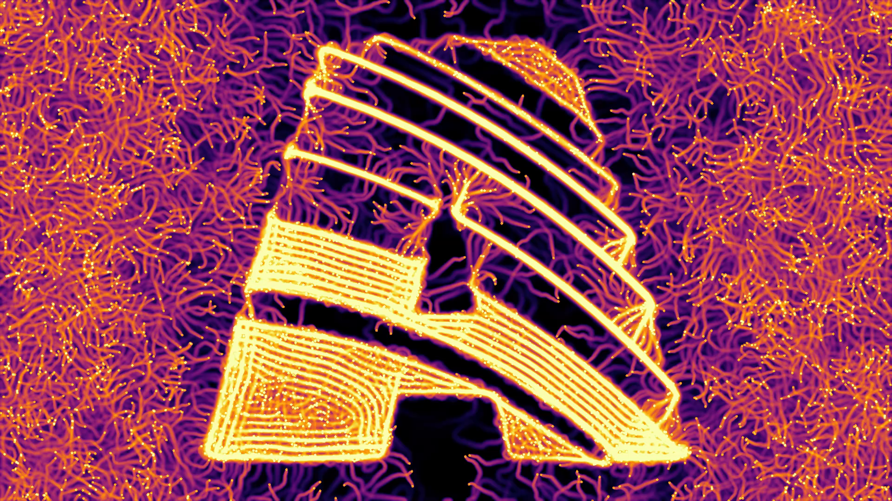

# Wire Patches

This is a private collection of [Resolume](https://resolume.com/) Wire patches. Something between case studies and actually useful stuff. 

## Legal Disclaimer

Everything is under **GPL-3** license which means you may use it commercially. However, if you use this as a base for another patch, it has to fall under GPL-3, too. You are **not allowed to sell** derivative work based on these patches but open source it and give back to the community.

For more info see https://www.tldrlegal.com/license/gnu-general-public-license-v3-gpl-3

(not a fan of gate keeping art)

## Patches

### Physarum

### Color Channel Swizzler
